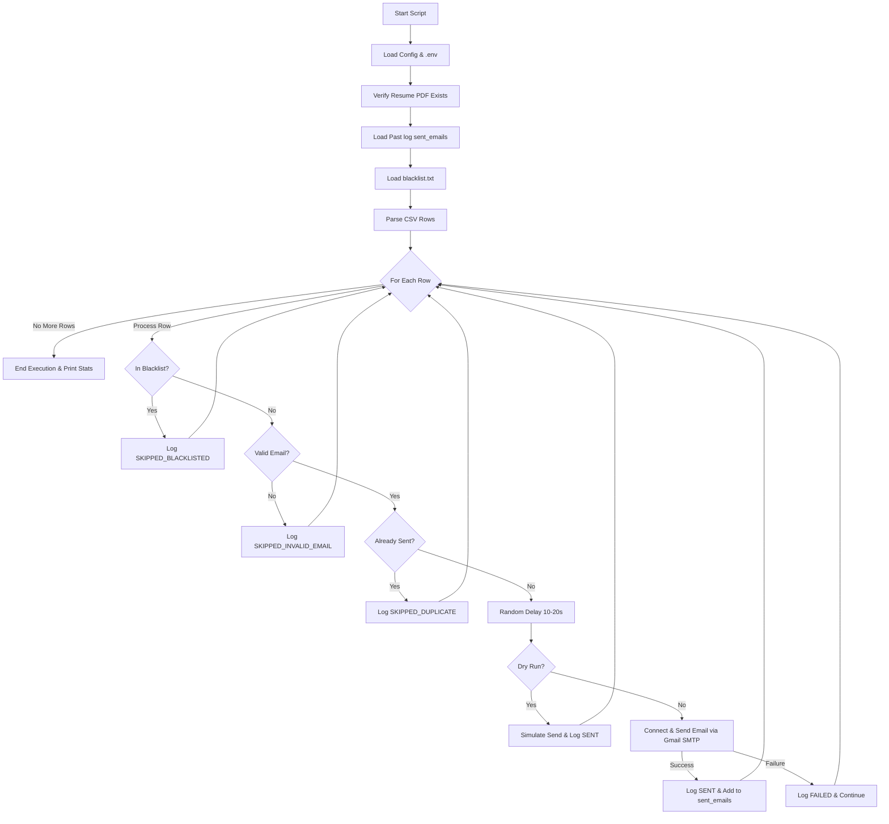

<div align="center">

# 📧 Email Merge Internship Application Script

_Automated, personalized, and spam-compliant email sender for internship applications using Gmail SMTP._

[](https://www.python.org/)
[](https://mail.google.com/)
[](https://github.com/bluecopperwire/email-auto)
[](https://opensource.org/licenses/MIT)

---

</div>

This project is a high-reliability, zero-dependency Python script designed to automate mailing internship applications. It replaces placeholders in a template with variables parsed from a CSV file, attaches a resume PDF, and sends emails via Gmail's SMTP server. It features extensive guardrails such as random send spacing, strict validation, automatic skip lists (blacklists), and persistent cross-session duplicate protection.

---

## 🛠️ System Architecture & Workflow

The script executes the following automated pipeline:



---

## ⚡ Quick Start Guide

Ready to run? Follow these five quick steps:

1. **Clone the Repo**:
   ```bash
   git clone https://github.com/bluecopperwire/email-auto.git
   cd email-auto
   ```
2. **Setup Credentials**:
   * Copy `.env.template` to `.env` (this file is ignored by Git, keeping your secrets safe).
   * Fill in your Gmail address and Gmail App Password in `.env`.
3. **Verify Attachments & Targets**:
   * Make sure your resume is located at `attachments/Resume.pdf`.
   * Make sure your target CSV file matches the name specified in the `CSV_FILE_PATH` key in `.env`.
4. **Run a Safe Simulation**:
   ```bash
   python send_emails.py --dry-run
   ```
5. **Run the Live Execution**:
   ```bash
   python send_emails.py --no-dry-run
   ```

---

## 📊 CSV Input & Mapping Specification

The script processes standard internship databases. Although the sheet can contain numerous logging and tracking columns, the script isolates and uses only the following fields:

| CSV Column Name | Used? | Mapping & Behavior |
| :--- | :---: | :--- |
| **COMPANY'S NAME** | **Yes** | Logged under target tracking and printed to terminal alerts. |
| **CONTACT PERSON** | **Yes** | Populates `{Greeting}`. Resolves to `Dear {CONTACT PERSON},` if present; defaults to `Dear Hiring Manager,` if blank. |
| **EMAIL ADDRESS** | **Yes** | Target recipient. Validated against RFC patterns and indexed as unique key for duplicate prevention. |
| *All Other Columns* | No | Safely bypassed during stream reading to maximize parsing speed. |

---

## 🗃️ Directory Structure

Ensure your local directory is organized as follows before launching:

```text
email-auto/
│
├── attachments/
│   └── Resume.pdf                                    # Application resume PDF (Required)
│
├── (APPLY via PUPInternlink) CCIS Host...csv         # Data spreadsheets containing company info
├── send_emails.py                                    # Main Python engine
├── blacklist.txt                                     # List of excluded companies or emails (One per line)
├── .env.template                                     # Configuration template file
├── .env                                              # Local environment secrets (Ignored by Git)
├── .gitignore                                        # Local Git ignore settings
├── email_log.csv                                     # Automated execution ledger
├── PROJECT_MEMORY.md                                 # Progress tracker
└── README.md                                         # Presentation documentation
```

---

## 🔒 Security & Git Operations

### 1. Credentials Safeguard
To guarantee your Gmail password and personal details are never exposed to public version control, the repository is pre-configured with a `.gitignore` containing:
```text
.env
```
Ensure you do not commit your `.env` file containing live SMTP passwords.

### 2. Version Control Command Reference
Stage and push any system updates, modifications, or template changes with the following standard commands:
```bash
git add send_emails.py README.md .env.template blacklist.txt requirements.txt
git commit -m "refactor: optimize system layouts and presentability"
git push origin main
```

---

## ⚙️ Detailed Configuration Guide

<details>
<summary>🔑 Step 1: Generate a Gmail App Password</summary>

Google disables standard password access for automated scripts. You must generate a secure **16-character App Password**:
1. Open your [Google Account Dashboard](https://myaccount.google.com/).
2. Navigate to the **Security** tab.
3. Make sure **2-Step Verification** is turned on.
4. Search for **App passwords** using the top search bar.
5. Create a new application name (e.g., "Internship Sender").
6. Copy the generated 16-character sequence (e.g., `xxxx xxxx xxxx xxxx`). Paste this directly into `.env` with no spaces.
</details>

<details>
<summary>📝 Step 2: Configure Environment Settings</summary>

Rename `.env.template` to `.env` and fill out your variables:
```env
GMAIL_ADDRESS=your.email@gmail.com
GMAIL_APP_PASSWORD=your16characterapppassword

# Set CSV file name (e.g., the 2026 ccis moa list)
CSV_FILE_PATH=(APPLY via PUPInternlink) CCIS Host Training Establishment Updated 2026-2021.csv

# Default Execution Parameters
RESUME_PATH=attachments/Resume.pdf
SMTP_SERVER=smtp.gmail.com
SMTP_PORT=465
MIN_DELAY=10
MAX_DELAY=20
DRY_RUN=True
```
</details>

<details>
<summary>🚫 Step 3: Populate Blacklist Exclusions</summary>

Write target company names or specific email addresses in [blacklist.txt](file:///d:/files/Online%20Classes/College/3rd%20Year/2nd%20Sem/random/email-auto/blacklist.txt) that you wish to skip (one entry per line). E.g.:
```text
# Blacklist file
Microsoft
hr@amazon.com
Apple Inc.
```
</details>

---

## 📈 Logging, Monitoring & Statuses

All actions write real-time entries to [email_log.csv](file:///d:/files/Online%20Classes/College/3rd%20Year/2nd%20Sem/random/email-auto/email_log.csv). The logging statuses are defined as follows:

| Log Status | Classification | Scenario / Action Taken |
| :--- | :--- | :--- |
| **SENT** | Success | Mail successfully delivered (or simulated in `--dry-run`). |
| **FAILED** | SMTP Failure | Server connection error. Logged with details; script continues. |
| **SKIPPED_DUPLICATE** | Redundant Target | Email already exists in `email_log.csv` under status `SENT`. |
| **SKIPPED_BLACKLISTED**| Excluded Target | Target matched an entry in `blacklist.txt` (case-insensitive). |
| **SKIPPED_INVALID_EMAIL**| Parse Error | Email address column is empty or fails regex formatting tests. |